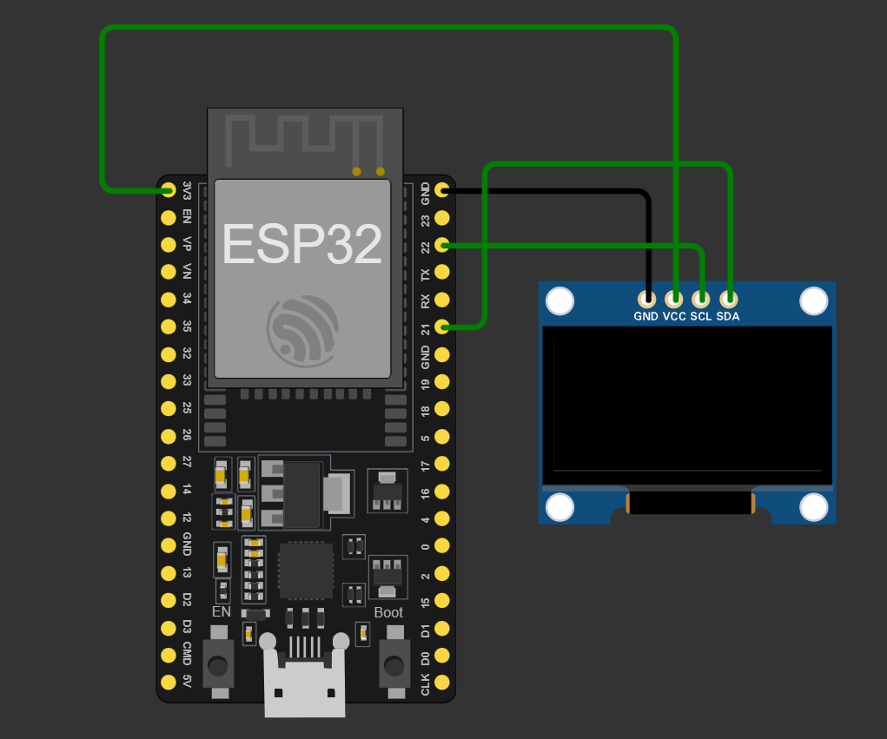

# ESP32-Weather-Displayg
This project utilizes the ESP32 microcontroller along with an OLED display to create a compact weather station. The station retrieves current weather data from the OpenWeatherMap API and displays it in a user-friendly format on the OLED screen.

# Features
* **Real-time Weather Display**: Shows current weather conditions such as temperature, humidity, and weather description.
* **Location-based Data:** Fetches weather data based on configurable location settings.
* **Low Power Consumption:** Optimized use of ESP32 capabilities for extended battery life.
* **Customizable Display**: OLED screen allows for clear and customizable weather information display.

# Components
* **ESP32 Microcontroller**: Main control unit for data processing and display management.
* **OLED Display**: Displays weather information in a clear and concise manner.
* **OpenWeatherMap API**: Provides weather data for the chosen location
# Circuit Diagram 

# Connects
| **ESP** | --> |**OLED** |
|---------|--|--------|
| **+5v** |-->| **VCC**  |
| **GND** |-->| **GND**  |
| **21**  |-->| **SDA**  |
| **22**  |-->| **SCL**  |

# Obtaining an API Key from OpenWeatherMap
To use the OpenWeatherMap API for retrieving weather data, you need to obtain an API key. Follow these steps:

 **1.Sign Up:**

* Go to the [OpenWeatherMap website](https://openweathermap.org/) .

* Click on the "Sign Up" button in the upper right corner of the homepage.

* Fill in the required information to create a new account. If you already have an account, simply log in.

**2.Create an API Key:**

* After logging in, navigate to the "API keys" section in your account dashboard.

* Click on the "Create Key" button.

* Enter a name for your API key (e.g., "ESP32 Weather Station").

* Click on the "Generate" button to create your API key.

**3.Copy the API Key:**

* Once the key is generated, it will be displayed in your API keys list.

* Copy the API key to your clipboard.
* Past in the code 
**4.countryCode**
* Go to home page [OpenWeatherMap website](https://openweathermap.org/)
* In the Search box search for your city 
* chech the **URL** the ending numbers is your county code 

**example:- https://openweathermap.org/city/1277333**

**1277333 is your countryCode which is requried in the code**

**Don't for to add your ur wifi details**

# Uploading Code:

**Upload the code to your ESP32 board using the Arduino IDE**

**Once the setup is complete, power on your ESP32 OLED Weather Station and it will start displaying weather information on the OLED screen.**

